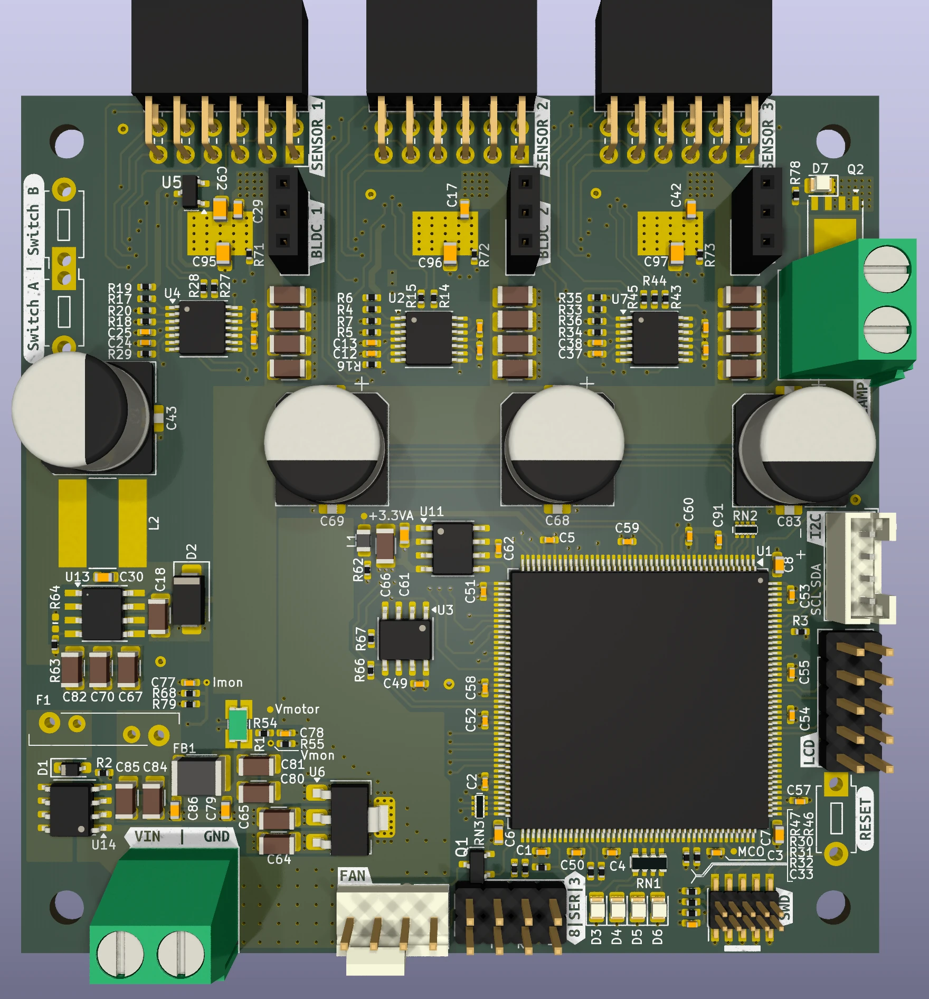

# FOCControllers
Exploring the world of FOC with BLDC/Steppers for custom haptic/force feedback in game controllers

Design is WIP.

## MCU
After some exploration, I've chosen to base this design around the STM32H725. There were several close runner ups, including some STM32G4 and F7 parts, and most honourable mention the RP2350. However, the RP2350 was not available from Mouser etc. at the time I started CAD. 
The secondary reason for the STM32H725 is that I still have a handful of these chips unassigned to a project in my parts bin. Considering they weren't cheap while coming in the "large brick" LQFP-176 package, this seemed like a good excuse to finally use them (-: 

Joking aside, this part is quite well suited for experiments with BLDC. Empirical observations using a Nucleo-H743 and the Arduino SimpleFOC library showed that the loopFOC() and move() functions take approximately 3.8 - 4.0us to execute on this chip (approx 1900 CPU cycles). This does not include sensor I/O. That means that running the FOC loop at 5-25kHz (depending on the position sensor datarate) will use around 2-10\% of CPU time. However, in this design I will be using this chip to drive 3 motors, which could bring up the CPU load to 30\%. 

This CPU time excludes I/O time from I2C/SPI bus transfers, or ADC data retrieval, "actual" FOC with DC current feedback, and more importantly, and force feedback algorithms. I would expect when this is all included that 25kHz loop speed would be quite the challenge.

I have also considered the RP2040, as I've used it for some exploration before concluding this design. However its lack of FPU and Cortex-M0+ could not do FOC loop calculations at more than 1kHz due to widespread floating point usage in SimpleFOC. Perhaps 2kHz was attainable when the slow I2C I/O is offloaded to the second core.. but 2kHz is still not a terrific loop speed. It didn't make sense to go through all that effort.

## Motor Driver
I have chosen to use the DRV8316C BLDC driver from Texas Instruments. This chip can use 6-PWM or 3-PWM mode with ENABLE input. The latter is necessary for SimpleFOC implementation of PWM and truth table to the (half-)H bridge drivers. Previous experiments with cheap DRV8833 boards were able to drive a BLDC motor, however, it was not controlling the DRV8833s properly due to its truth table orientated at brushed motor control (long story..). 

Moreover, the DRV8316C chip can operate with 24V supply. and drive 3-5A into motors. I plan to use this magnitude of power for developing an active pedal for simrig racing. These typically require motors in the order of 60-90Watt peak. 

The whole board will be fused for a continuous current of 5A. This may seem awkward to divide across 3 channels, but I expect the duty cycle and concurrent power output to be quite low for this application.

##  Sensing
The board contains, per motor channel, the interfaces for the following sensors:

- I2C magnetic encoders (e.g. As5600)
- SPI or Infineon SSC magnetic encoders (e.g. TLE5012B or TLI5012B)
- Lineair Potentiometer
- NTC for motor temperature
- Current Sense for all 3 coil outputs

The analog sensor channels are connected to a dedicated ADC on the STM32H7 each. The chip will be programmed to convert all channels on each FOC cycle.

All analog channels are referenced against a 3.0V voltage reference. BLDC channel 1 contains a 3.0V regulator to power the analog electronics for all 3 motor channels.

## Other stuff
The PCB contains several support functions which should aid for a configurable & robust driver:

- I2C 24AAxx EEPROM (bitbanged)
- I2C temperature sensor near driver of channel 2 (bitbanged)
- Voltage/Current monitor of input supply
- 5V/Vin 4-pin PWM fan with tacho readout. The board has a 80x80mm form factor in case it runs hot.
- Power clamp to dump regen power (if necessary).
- SPI interface for driving a small LCD
- I2C Grove Connector (hardware I2C)
- 2 UARTs
- 4 Debug LEDs
- 2 Push Buttons
- SWD debug